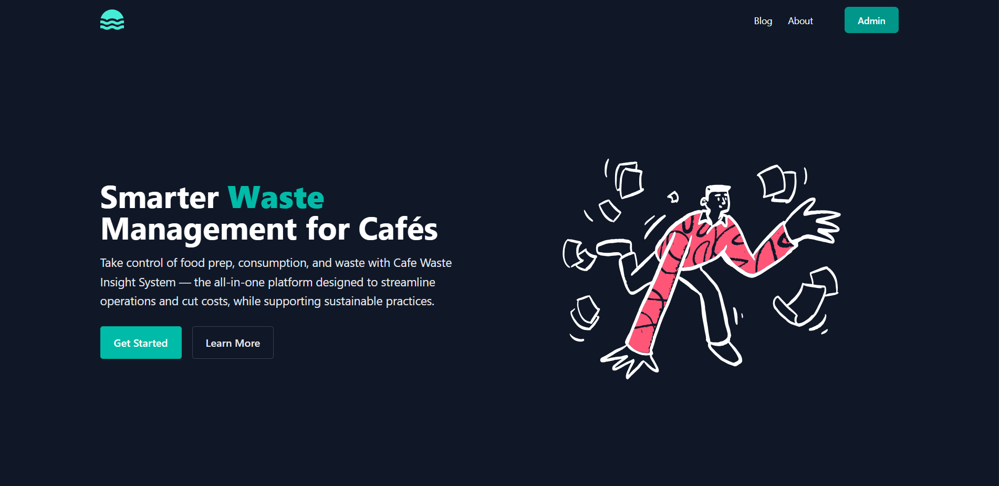
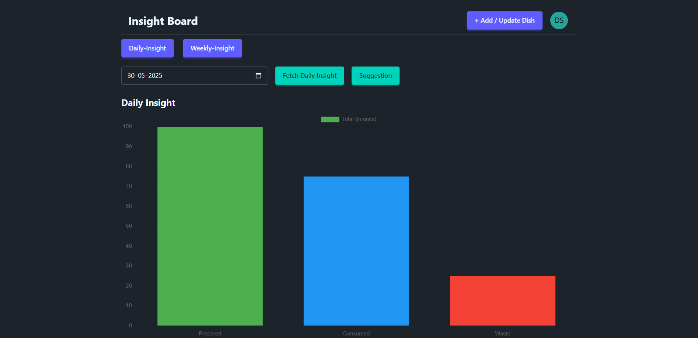
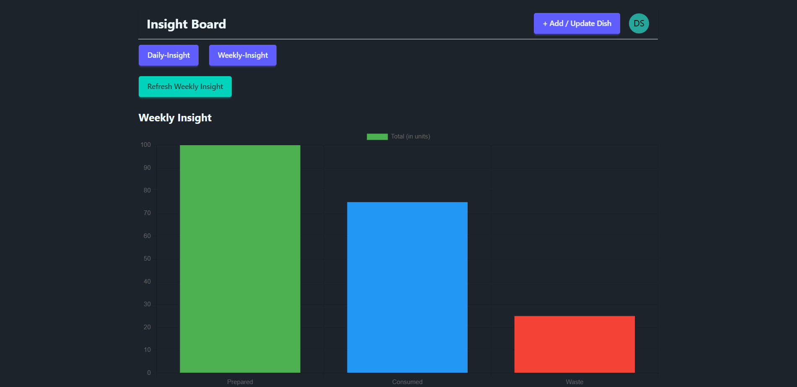

# ☕ Cafe Waste Insight System

The **Cafe Waste Insight System** is a full-stack web application that helps cafe administrators track food preparation, consumption, and waste in real time — boosting operational efficiency, reducing costs, and supporting sustainability through one easy-to-use platform.

## 🔐 Admin Authentication

- Only **one admin login** is supported.
- Features:
  - Secure **login/logout** functionality.
  - **Reset password** option.
  - Auth handled with **JWT stored in cookies**.

## 📊 Insight Dashboard

The dashboard is the heart of the system, offering multiple data visualizations and controls.

### ➕ Add/Update Dish

- Input form to **add or update dish** records.
- Captures:
  - **Dish name**
  - **Quantity**
  - Whether it’s **Prepared** or **Consumed**

---

### 📅 Today's Insight

- Displays data for the **current day by default**.
- Features:
  - **Bar graph**: Total Prepared, Consumed, and Wasted quantities.
  - **Pie chart per dish**: Insightful visualization of waste per item.
  - **Smart Suggestions** based on trends.
  - **WhatsApp alert**: Sends to the admin if waste exceeds a set **threshold** using **Twilio API**.

---

### 📆 Daily Insight (Custom Date)

- Input a **specific date** to view insights.
- Visuals:
  - **Bar graph**: Daily prep, cons, and waste.
  - **Pie chart per dish**
  - **Suggestions** with a dedicated button.

---

### 📈 Weekly Insight

- Aggregates data **from Sunday to Saturday**.
- Visuals:
  - **Bar graph**: Weekly overview of prep, cons, and waste.
  - **Pie chart per dish**
  - **Suggestions** with a button.

---

## 💻 Tech Stack

### Backend:
- Node.js
- Express.js
- MongoDB (Mongoose)
- JWT (JSON Web Token) for authentication
- Twilio API (for WhatsApp alerting)

### Frontend:
- React.js
- Tailwind CSS
- Chart.js
- DaisyUI

---

## 📸 Screenshots

### 🖼️ Home Page View


### 🖼️ Today / Daily Insight Dashboard


### 🖼️ Weekly Dashboard


---

## 🚀 Getting Started

### 1. Clone the repository

```bash
git clone https://github.com/Dev-CodeBox/Cafe-Waste-Insight-System.git
cd cafe-waste-insight
```

### 2. Backend Setup

```bash
cd backend
npm install
npm run dev
```

### 3. Frontend Setup

```bash
cd frontend
npm install
npm start
```

### 4. Environment Variables

Setup `.env` in the backend with:

```env
JWT_SECRET=your_secret_key
MONGO_URI=your_mongodb_connection_string
TWILIO_ACCOUNT_SID=your_twilio_sid
TWILIO_AUTH_TOKEN=your_twilio_auth
TWILIO_PHONE=your_twilio_number
ADMIN_PHONE=admin_whatsapp_number
```

---

## 📞 Alert System

Whenever waste exceeds a specific threshold, the system:
- Automatically sends a **WhatsApp alert to the admin**
- Helps reduce food waste and improve decision-making

---

## 📬 Contributions

Pull requests are welcome. For major changes, please open an issue first.

---

## 📄 License

[MIT](LICENSE)
